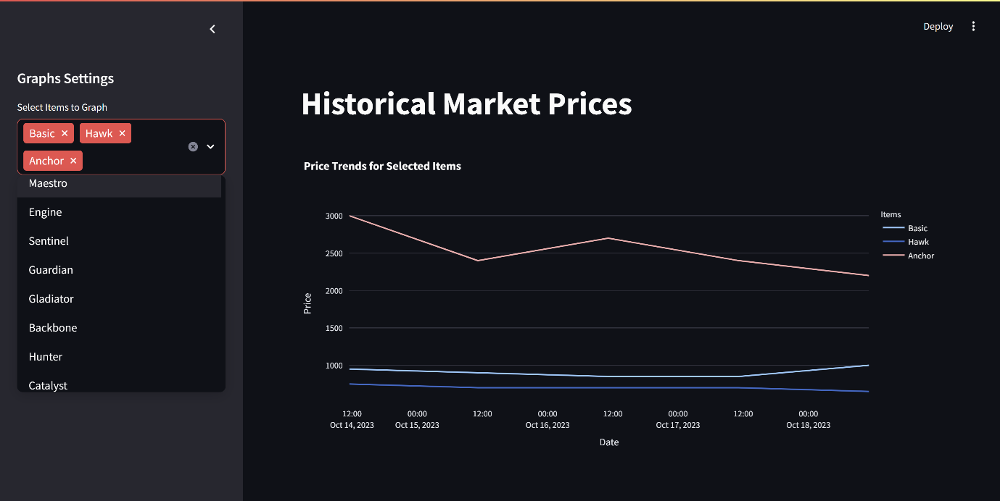

# EAFC Transfer Market Price Forecaster

A data pipeline and interactive app for tracking, cleaning, visualising and forecasting item prices on the EA FC (EAFC) Ultimate Team transfer market. Built as my A-level Computer Science NEA project.

It ingests hourly price snapshots, cleans out noise and outliers, stores everything in a SQLite database, and serves it through a Streamlit app where you can graph any item's price history and project it forward with a linear-regression forecast.



## What it does

- **Ingests** a directory of hourly CSV price snapshots into a single pandas DataFrame.
- **Cleans** the data per item with a rolling-window mean that smooths spikes and caps outliers, so noisy scraped prices become a usable series.
- **Stores** both the raw and cleaned data in a SQLite database, and reads it back to verify integrity.
- **Visualises** any item's price history through an interactive Streamlit + Plotly interface.
- **Forecasts** future prices for a chosen item over a user-selected horizon (3–30 days) using a scikit-learn `LinearRegression` model.

## Tech stack

Python · pandas · NumPy · SQLite (`sqlite3`) · scikit-learn (`LinearRegression`) · Streamlit · Plotly · Matplotlib

## Repository structure

```
eafc-price-forecaster/
├── src/
│   ├── backend.py      # data pipeline: CSV ingest → clean → SQLite → charts
│   └── frontend.py     # Streamlit app: menu, grapher, forecaster, about page
├── data/
│   └── sample/         # a sample of the hourly price CSVs (full dataset is hundreds of files)
├── output/
│   └── Market_prices_cleaned_all.db   # the cleaned SQLite database
├── docs/               # screenshots
└── archive/            # earlier drafts and iterations, kept for development history
    ├── earlier-code/
    └── secondary-code/
```

## Data format

Each CSV is a single hourly snapshot of the market, named by date and hour (`2023-10-14--11.csv`):

```
chem,date,delay,price,time
Basic,2023-10-14,9 min Ago,950,11:30:08
Sniper,2023-10-14,9 min Ago,200,11:30:08
```

Each row is one chemistry-style item with its listed price at that time.

## Running it

1. Install the dependencies:
   ```
   pip install pandas numpy scikit-learn streamlit plotly matplotlib
   ```
2. Open `src/backend.py` and `src/frontend.py` and set the `base_path` variable near the top of each file to the folder where you cloned this repo. (It points at the data and database folders.)
3. Run the pipeline once to build the database (`src/backend.py`), then launch the app:
   ```
   streamlit run "src/frontend.py"
   ```

## Notes

- This was my A-level NEA, so `archive/` keeps the earlier iterations and working versions — the finished code lives in `src/`.
- `data/sample/` holds a representative slice of the data; the original project ran on several hundred hourly snapshots.
